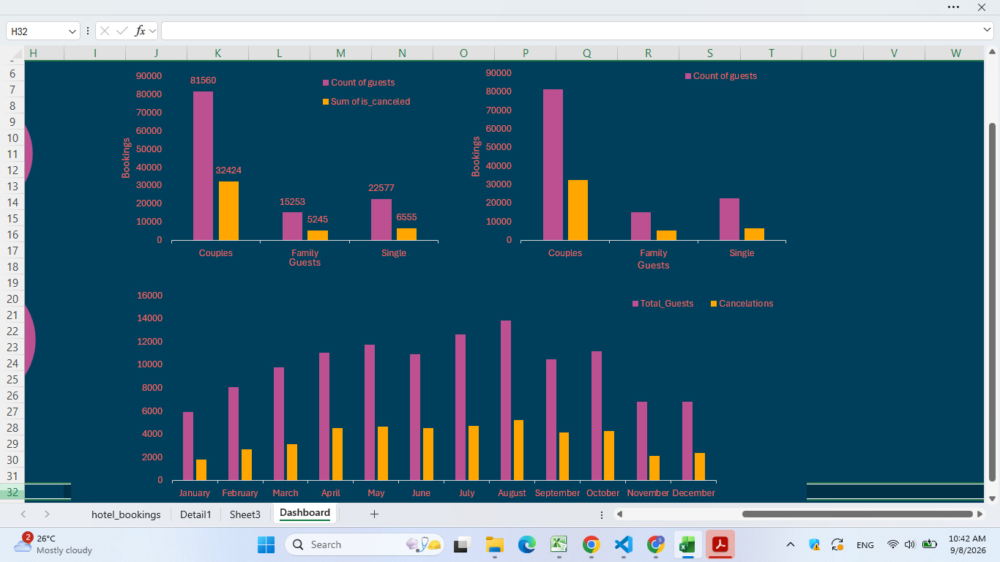
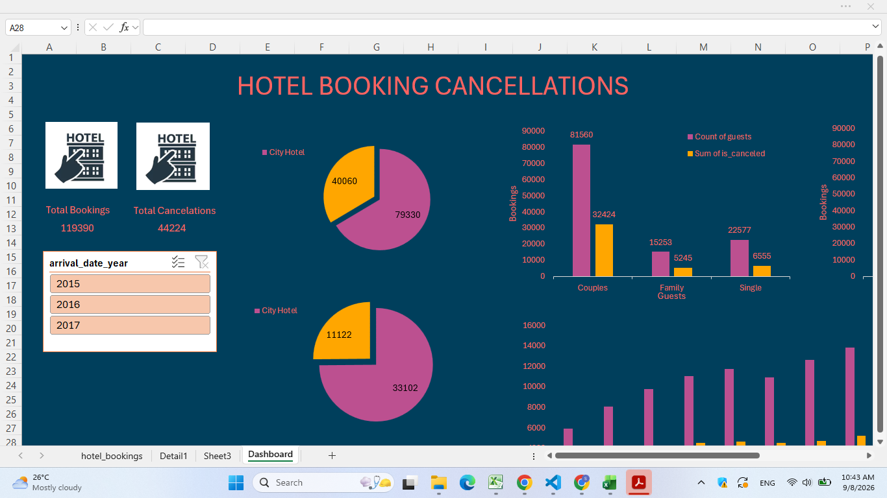
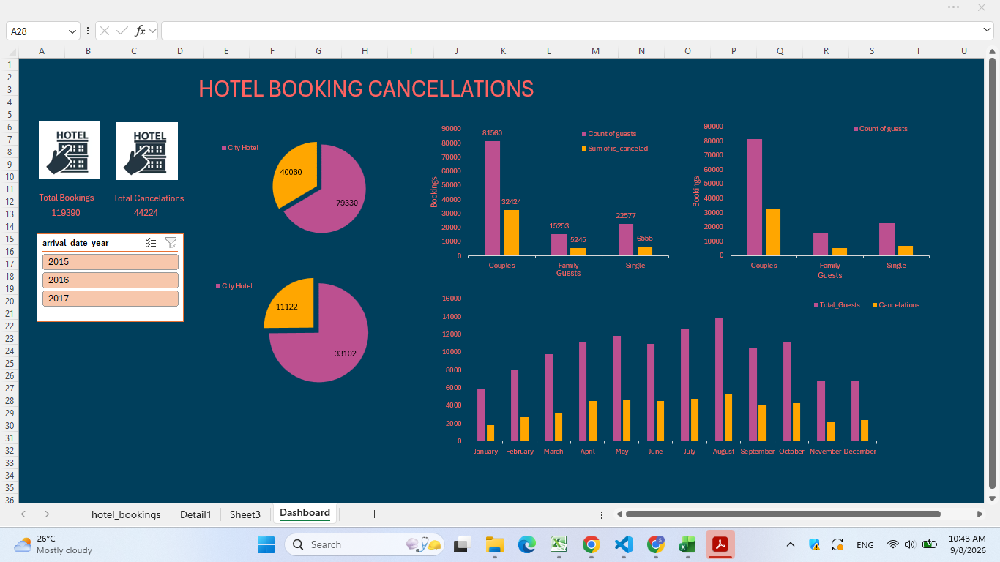

# Hotel Booking Data Analysis Dashboard

## Overview
An interactive Excel dashboard built to analyze hotel booking trends, cancellations, and customer behavior from a large real-world dataset. The project focuses on transforming raw booking records into clear, decision-ready visuals using native Excel tools — no external BI software required.

## Dataset
- **Size:** 1,17,297 rows × 32 columns
- **Domain:** Hotel bookings (reservation details, cancellations, guest demographics, stay duration, etc.)
- **Source:** https://www.kaggle.com/code/azmainmorshed/hotel-bookings-basic-eda/input

## What I Built
- **Custom calculated columns** using nested `IF` statements to classify and clean raw booking data for analysis
- **Bar charts** to compare booking volume and cancellation trends across categories (e.g., hotel type, month, market segment)
- **Pie charts** to visualize proportional breakdowns (e.g., cancellations vs. completed stays, customer type distribution)
- **Slicers** to make the dashboard interactive, allowing quick filtering by hotel type, year, or booking status

## Key Skills Demonstrated
- Data cleaning and transformation on a large dataset (100K+ rows)
- Logical formula design (`IF`, nested conditions) for feature engineering
- Dashboard design and data storytelling using Excel visualizations
- Making raw data usable for non-technical stakeholders via interactive filtering

## Dashboard Preview

## Tools Used
Microsoft Excel (PivotTables, PivotCharts, Slicers, Conditional Logic)

## Files in this Repo
- `hotel_booking_dashboard.xlsx` — the full interactive dashboard
- `Dashboard_1.png`, `Dashboard_2.png`, `Dashboard_3.png` — static previews of the dashboard views

---
*Built as a self-driven project to explore data analytics as a career direction.*
